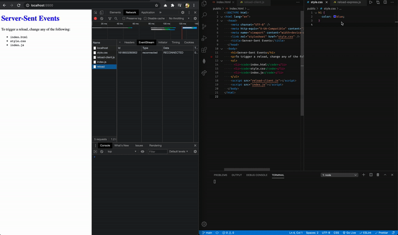

# Server-Sent Events

## Automatically refresh client when any file changes are saved

### ✅ Lightweight and easy to use

Use cases:

✔︎ Non-framework projects 
✔︎ Bare-bones React projects ( e.g. React, Babel, webpack, ... )  
✔︎ Building mock APIs  
✔︎ Et cetera...  

